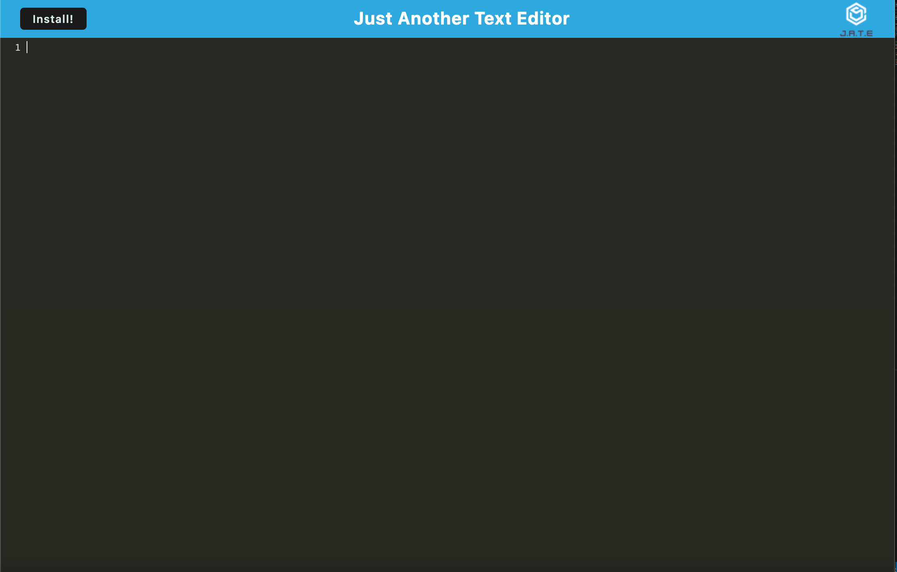
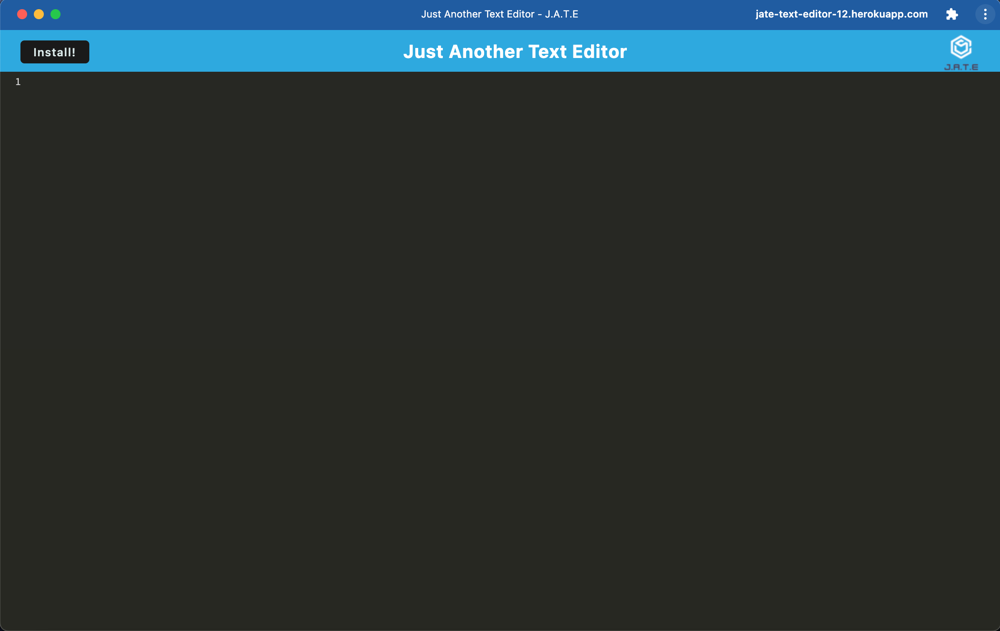

# Just Another Text Editor (J.A.T.E)

## Description

JATE is an application that allows a user to enter text and save the text. The application is deployed using Heroku, so the user can visit the link, and they will be taken to the application. This application is very useful because it allows users to create notes and automatically save them in the cache of their browser. There is also an install feature on the application that the users can click to install the app on to their computer. This will allow users to use the application even in offline mode, so if they are not connected to the internet, they can still use the application. The app is very convenient to organize users' notes. A couple screenshots are added below to show the user what the application looks like. 

## Screenshots 

## Deployment Link

https://jate-text-editor-12.herokuapp.com/ 